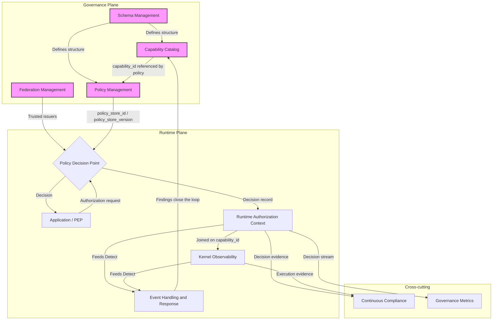

# Architecture Diagram

This is the high-level, single-glance view of the GovOps architecture: the two planes, the nine
services, and how a decision and its evidence flow between them. For the C4 Level 1 boundary (what
is inside GovOps vs. external), see `./system-context.md`. For the full C4 Level 2 container
diagram with every relationship labeled, see `./component-view.md`.

This diagram intentionally shows all nine services named in `../components/README.md` rather than
only the five sometimes called "core" — see
`../../06-decisions/ADR-002-nine-service-reference-model.md` for that unresolved naming question.
Continuous Compliance and Governance Metrics are drawn as cross-cutting rather than inside either
plane, consistent with `./README.md#5-the-four-functional-layers`.

The loop this diagram implements, in words, is `./README.md#4-the-govops-loop`:
`Govern → Authorize → Execute → Observe → Detect → Respond → Govern`.
