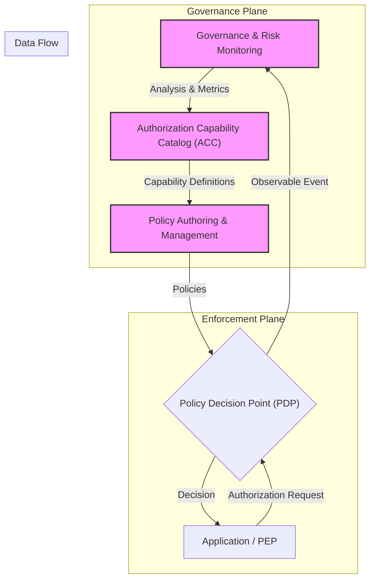

```mermaid
graph TD
    subgraph Governance Plane
        A["Governance & Risk Monitoring"]
        B["Authorization Capability Catalog (ACC)"]
        C["Policy Authoring & Management"]
    end

    subgraph Enforcement Plane
        D{"Policy Decision Point (PDP)"}
        E["Application / PEP"]
    end

    subgraph Data Flow
        C -- Policies --> D
        B -- Capability Definitions --> C
        E -- Authorization Request --> D
        D -- Decision --> E
        D -- Observable Event --> A
        A -- Analysis & Metrics --> B
    end

    style A fill:#f9f,stroke:#333,stroke-width:2px
    style B fill:#f9f,stroke:#333,stroke-width:2px
    style C fill:#f9f,stroke:#333,stroke-width:2px
```
