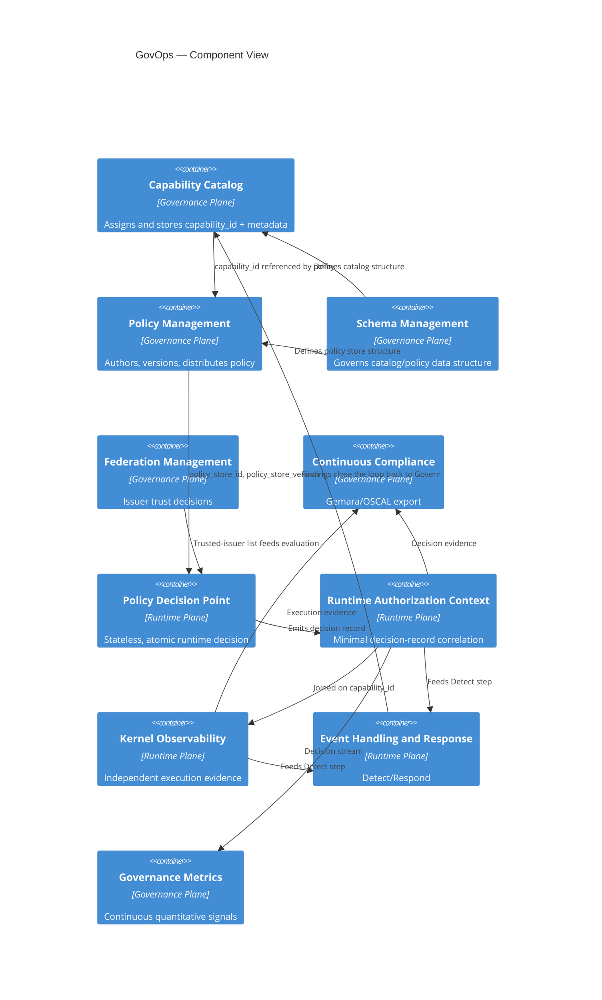

# Component View

This view sits between the system-context boundary (`./system-context.md`) and the individual
component reference pages (`../components/`). It shows how the services relate to one another and
traces a single capability's data through the full lifecycle.

## Services and relationships



## The `capability_id` data-flow trace

The single most important property of this architecture is that one identifier —
`capability_id` — is traceable end-to-end without ever requiring the intermediate systems to share
anything else:

```text
Capability Catalog (capability_id assigned at Register)
    │
    ▼
Policy Management (policy references capability_id; policy_store_id/version assigned)
    │
    ▼
Policy Decision Point (evaluates request; decision made)
    │
    ▼
Runtime Authorization Context (capability_id, decision, decision_id, policy_store_id,
                                policy_store_version — minimal record)
    │
    ├──▶ Kernel Observability (independent execution evidence, joined on capability_id)
    │
    ├──▶ Event Handling and Response (Detect/Respond, keyed on capability_id)
    │
    └──▶ Continuous Compliance (Gemara → OSCAL export, keyed on capability_id)
```

No token, policy text, or full request payload crosses these boundaries — only the identifiers
themselves (see `../components/runtime-authorization-context.md`). This is what makes the
correlation mechanism safe to use as a cross-cutting join key: it is minimal by design (see
`../security/README.md`).

## Relationship to the nine-service model

This view intentionally shows ten boxes (nine GovOps services plus the two-plane grouping),
consistent with `../components/README.md`'s enumeration. See
`../../06-decisions/ADR-002-nine-service-reference-model.md` for the unresolved question of why
only five of these are sometimes called "core."
