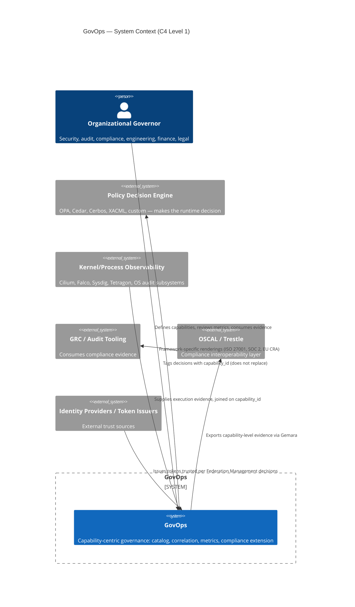

# System Context (C4 Level 1)

This is the highest-level view of GovOps: who uses it, what it depends on, and where its boundary
sits relative to systems it does not itself define. See `./README.md` for the loop and layer model
this diagram implements, and `../../00-foundations/scope.md` for the precise boundary statement in
prose form.

## Actors and external systems

| Actor / system | Relationship to GovOps |
|---|---|
| Organizational governors (security, audit, compliance, engineering, finance, legal) | Consume and act on GovOps's catalog, decisions, and metrics — see `../../01-explanation/stakeholder-goals/README.md`. |
| Policy decision engines (OPA, Cedar, Cerbos, XACML, custom) | External to GovOps; make the actual runtime allow/deny call. GovOps requires only that decisions can be tagged with a `capability_id`. |
| Kernel/process observability tools (Cilium, Falco, Sysdig, Tetragon, Linux Audit, Windows ETW, macOS Endpoint Security) | External; supply execution evidence. GovOps does not implement or replace them — see `../components/kernel-observability.md`. |
| GRC / audit tooling | Consumes compliance evidence exported through the Gemara/OSCAL path. |
| OSCAL / Trestle | External compliance-interoperability layer that GovOps's Continuous Compliance service targets, rather than reinventing. |
| Identity providers / token issuers | External; Federation Management governs which of these an organization trusts, but does not implement token issuance or validation itself. |

## Diagram

GovOps's boundary is deliberately narrow: it owns the capability data model, the correlation
identifiers, the metrics, and the compliance extension point. It does not own policy evaluation,
token issuance/validation, or kernel-level instrumentation — those remain external systems that
GovOps integrates with via `capability_id` correlation. See `../../00-foundations/scope.md` for the
full "what GovOps does not (yet) define" list.
